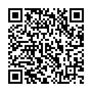

# 2017F COMP3111 Group 12

This is the team repo for Group 12, developing a LINE chatbot for Topic 1 (Guangdong travel agency).
This is a repository forked from AYHYAP's github, based on a complete version of lab 2, i.e. milestone 0.

# Javadocs and Test report
[Javadocs](https://bitbucket.org/hkustf2017comp3111group12/chatbot-working-repo/src/c980685c9909d728b01e151204fea7f8b4196286/sample-spring-boot-kitchensink/build/docs/javadoc/allclasses-frame.html?at=master&fileviewer=file-view-default)
[JaCoCo Test Report](https://bitbucket.org/hkustf2017comp3111group12/chatbot-working-repo/src/c980685c9909d728b01e151204fea7f8b4196286/sample-spring-boot-kitchensink/build/jacocoHtml/index.html?at=master&fileviewer=file-view-default)

Team Line chatbot:

Team Heroku account:
* email: jeffersonjefferchan@gmail.com
* pwd: *Please refer to "heroku acc.txt" in google drive*

# Labs (for reference)

[Chatbot Deployment](./lab1.md)
[Chatbot with static file Database](./lab2.md)
[Chatbot with SQL Database](./lab3.md)